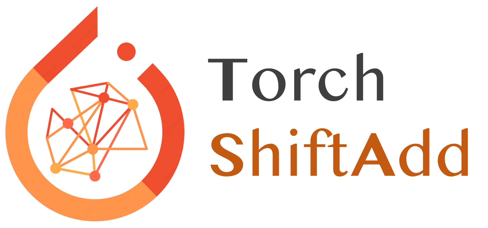

<p align="center">
    
</p>

<h2 align="center">
    A PyTorch library for developing energy efficient multiplication-less models.
</h2>

[](https://opensource.org/licenses/Apache-2.0)
[](https://github.com/GATECH-EIC/torchshiftadd/blob/master/CONTRIBUTING.md)

# TorchShiftAdd Overview

Welcome to TorchShiftAdd, your go-to open-source library for crafting energy-efficient multiplication-less models and applications!

[TorchShiftAdd](https://github.com/GATECH-EIC/torchshiftadd) embodies a pioneering initiative to simplify and expand the realm of multiplication-less networks within the machine learning community. Key features include:

* Ready-to-use implementation of a wide range of ShiftAdd-based multiplication-less CNNs or Transformers.
* CUDA kernels and TVM compilation support for seamless GPU deployment.
* Profiling tools to furnish FLOPs, energy, and latency breakdown data for in-depth analysis and optimization.
* Hardware accelerator simulators to estimate energy savings and latency improvements on ASICs or FPGAs.
* Flexible support for developing both algorithmic and hardware accelerator designs tailored for multiplication-less networks.

<!-- <details><summary>List of Implemented Papers</summary><p> -->

## List of Implemented Papers
* **ShiftAdd-based Convolutional Neural Networks**
    + [[NeurIPS'20] ShiftAddNet: A Hardware-Inspired Deep Network](https://arxiv.org/abs/2010.12785)
    + [[CVPR'20 Oral] AdderNet: Do We Really Need Multiplications in Deep Learning?](https://arxiv.org/abs/1912.13200)
    + [[CVPR'21 Workshop] DeepShift: Towards Multiplication-Less Neural Networks](https://arxiv.org/abs/1905.13298)
* **ShiftAdd-based Transformers**
    + [[NeurIPS'23] ShiftAddViT: Mixture of Multiplication Primitives Towards Efficient Vision Transformer](https://arxiv.org/abs/2306.06446)
    + [[NeurIPS'24] ShiftAddLLM: Accelerating Pretrained LLMs via Post-Training Multiplication-Less Reparameterization](https://arxiv.org/abs/2406.05981)
* **Hardware Accelerators for ShiftAdd-based Multiplication-less Networks**
    + [[ICCAD'22] NASA: Neural Architecture Search and Acceleration for Hardware Inspired Hybrid Networks](https://arxiv.org/abs/2210.13361)
    + [[IEEE TCAS-I] NASA+: Neural Architecture Search and Acceleration for Multiplication-Reduced Hybrid Networks](https://ieeexplore.ieee.org/document/10078392)

# Installation

````bash
python setup.py install -e .
````

# Qucik Start

Currently codebase supports ShiftAdd-based CNNs. To use them, check our test files:

````bash
python test/models/test_resnet20_adder.py
python test/models/test_resnet20_shift.py
python test/models/test_resnet20_shiftadd.py
````

# Upcoming Features

We will continously develop this toolbox:

- [x] ShiftAdd-based Convolutional Neural Networks
- [ ] ShiftAdd-based Transformers
- [ ] Hardware Accelerators for Energy & Latency Estimation

# Contributing

TorchShiftAdd is released under [Apache-2.0 License](LICENSE). Everyone is welcome to contribute to the development of TorchShiftAdd. Please refer to [contributing guidelines](CONTRIBUTING.md) for more details.

# Acknowledgement

All co-authors of ShiftAddNet, ShiftAddNAS, ShiftAddViT, and ShiftAddLLM.